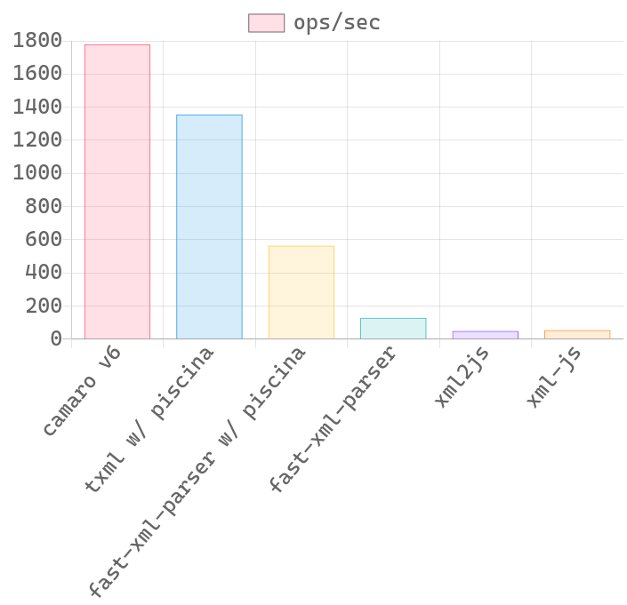
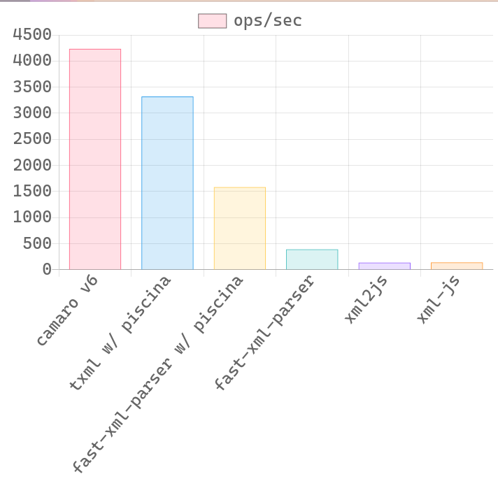
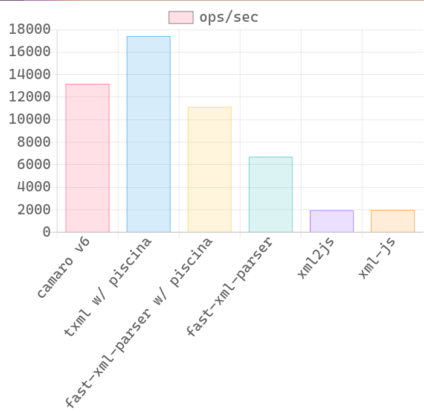

# Benchmark

Never mind about the actual number. You can check the percentage differences between package for reference.

Benchmark ran on Macbook 16".

## transform()

`node benchmark/transform`

Benchmark scenario:
- 10,000 iterations
- 4 different input size: 7KB/ 60KB / 100KB and 300KB. Test inputs are included in `fixtures` folder.
- Output is average no. of ops per second.
- Machine specs: AMD 4650G 6 cores - 12 threads/ 32GB memory

As you can see `camaro` is not very good with small XML file. However, it excels with big XML file.

300 KB XML file            |  100 KB XML file
:-------------------------:|:-------------------------:
    |  

60 KB XML file             |  7 KB XML file
:-------------------------:|:-------------------------:
     |  

## prettyPrint()

`node benchmark/pretty-print`

`camaro` loses big time here.

```
camaro v6: 62,363.2 ops/sec
pretty-data: 141,257.8 ops/sec
prettifyXml: 258,408 ops/sec
```
